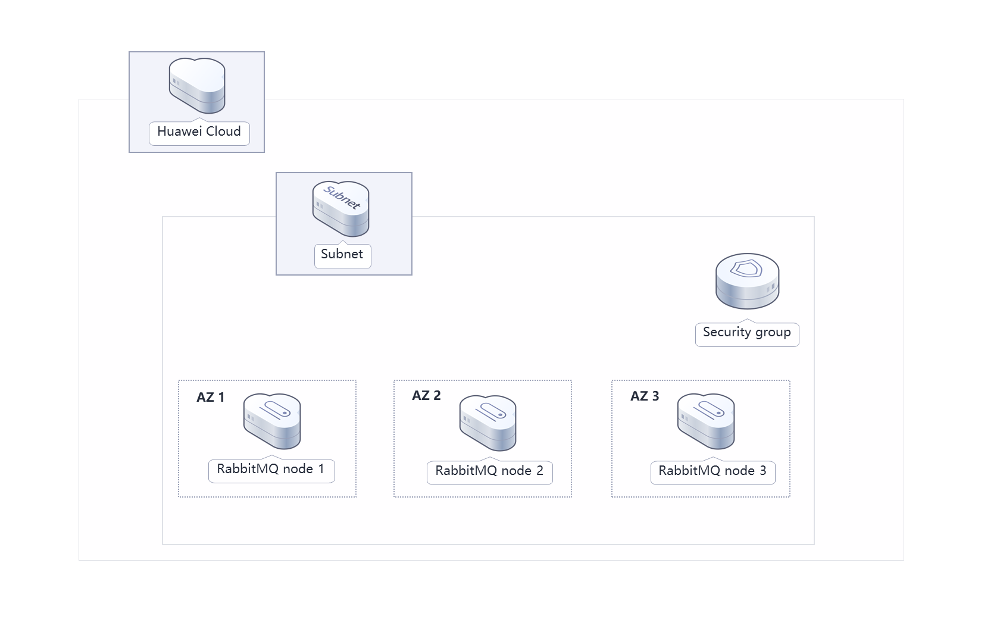
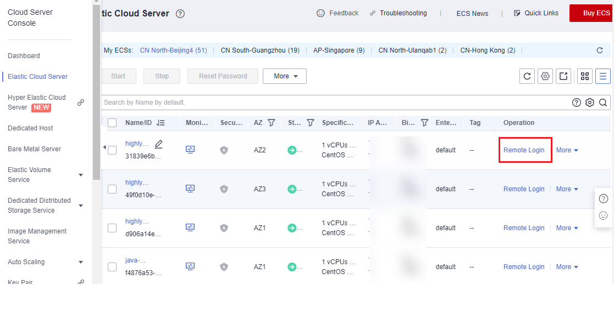
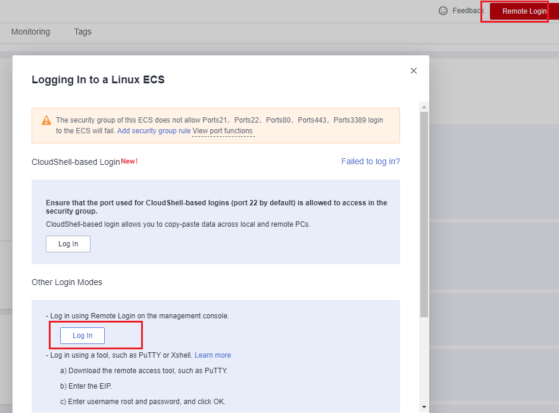
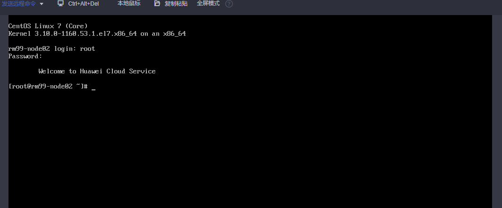
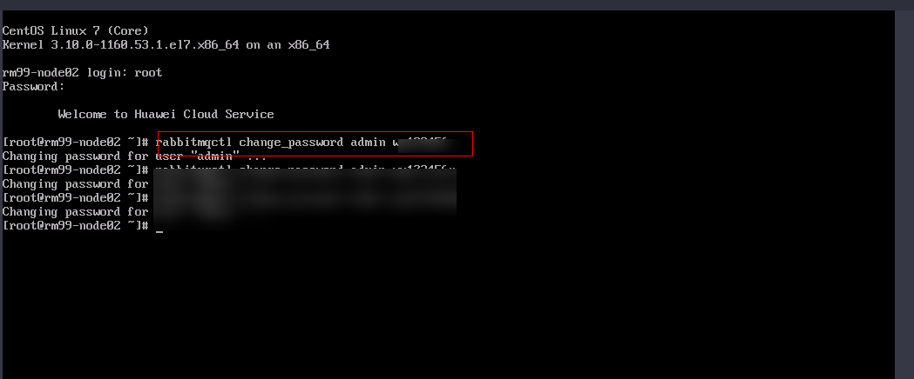
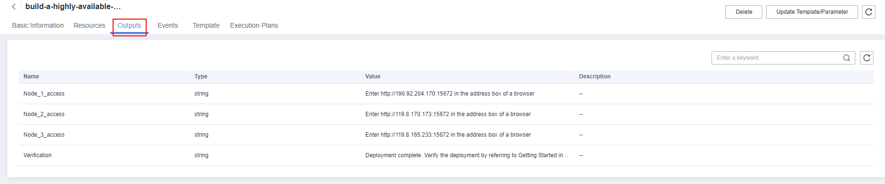
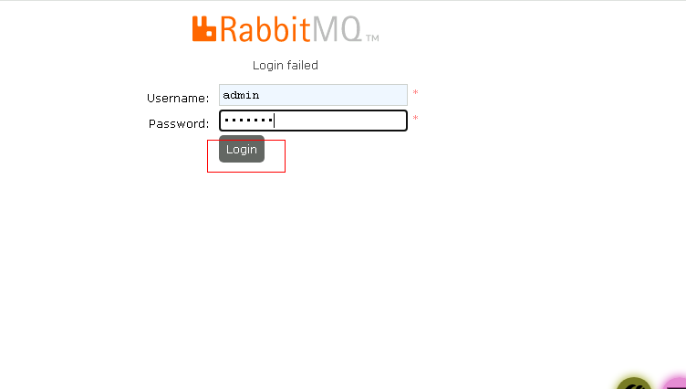
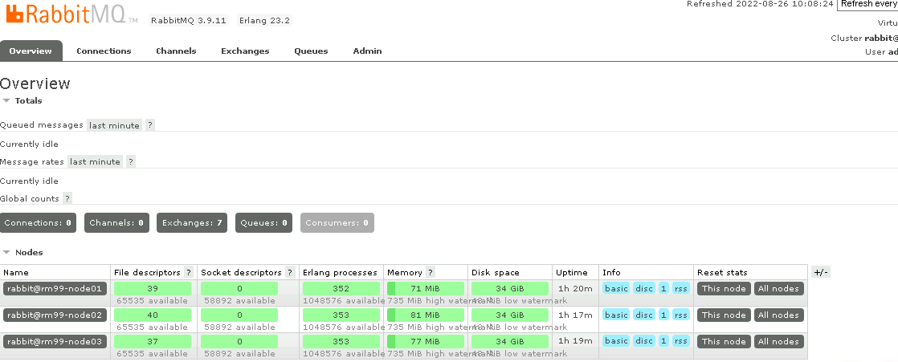

[TOC]

**Solution Overview**
===============
This solution helps you set up high-availability RabbitMQ cluster on Huawei Cloud Elastic Cloud Servers (ECSs). RabbitMQ is open-source message-oriented middleware developed in Erlang to implement the Advanced Message Queuing Protocol (AMQP). It supports multiple programming languages.

**Architecture**
---------------


**Architecture Description**
---------------
This solution will:

1. Create three Linux ECSs, which will be deployed in different AZs to work as RabbitMQ nodes.

2. Create three elastic IP addresses (EIPs), which will be used for internal and external communication.

3. Create a security group to enhance ECS security and set security group rules to specify ports that allow access to the ECSs.

**File Structure**
---------------

``` lua
huaweicloud-solution-build-a-highly-available-RabbitMQ-cluster
├── build-a-highly-available-RabbitMQ-cluster.tf.json -- Resource orchestration template
├── userdata
    ├── install_node01.sh  -- Script configuration file
    ├── install_node02.sh  -- Script configuration file
    ├── install_node03.sh  -- Script configuration file
```
**Getting Started**
---------------
***(Optional) Changing the RabbitMQ Password***

1. Log in to the [ECS console](https://console-intl.huaweicloud.com/ecm/?agencyId=WOmAijZnbElNjCFzTVDl4aJQAgdaTUMD&locale=en-us&region=ap-southeast-3#/ecs/dashboard), select any of the ECSs created, and click **Remote Login** or use any other tool to log in to the Linux ECS.

	Figure 1 ECS console
	

	Figure 2 Logging in to a Linux ECS
	

2. On the ECS, enter the username and password and press **Enter**.

	Figure 3 Logging in to an ECS
	

3. Run **rabbitmqctl change_password** *Username* *New password* to change the password.

	Figure 4 Changing the password
	

***Verifying Deployment of the RabbitMQ Cluster***

1. Click the **Outputs** tab and select any node.

	Figure 5 Outputs
	

	Figure 6 RabbitMQ webpage
	

2. Enter the username and password, and click Login.

	Figure 7 Entering the username and password
	

	Figure 8 Cluster page
	
